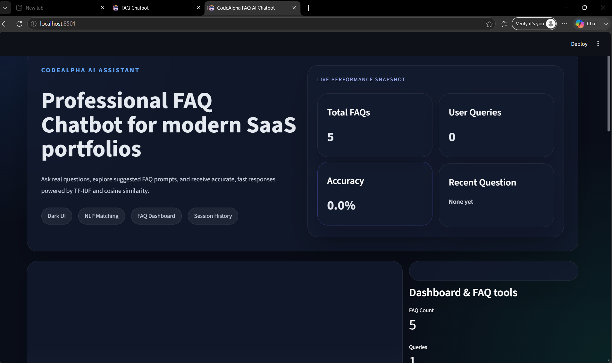
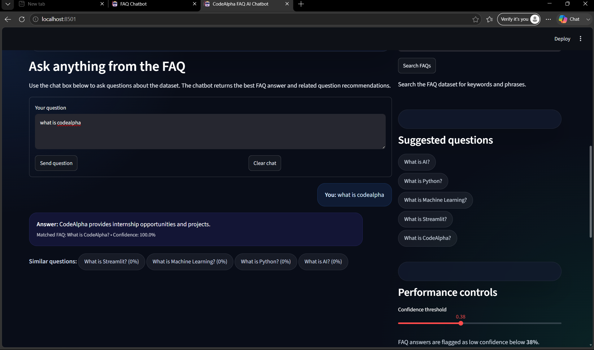
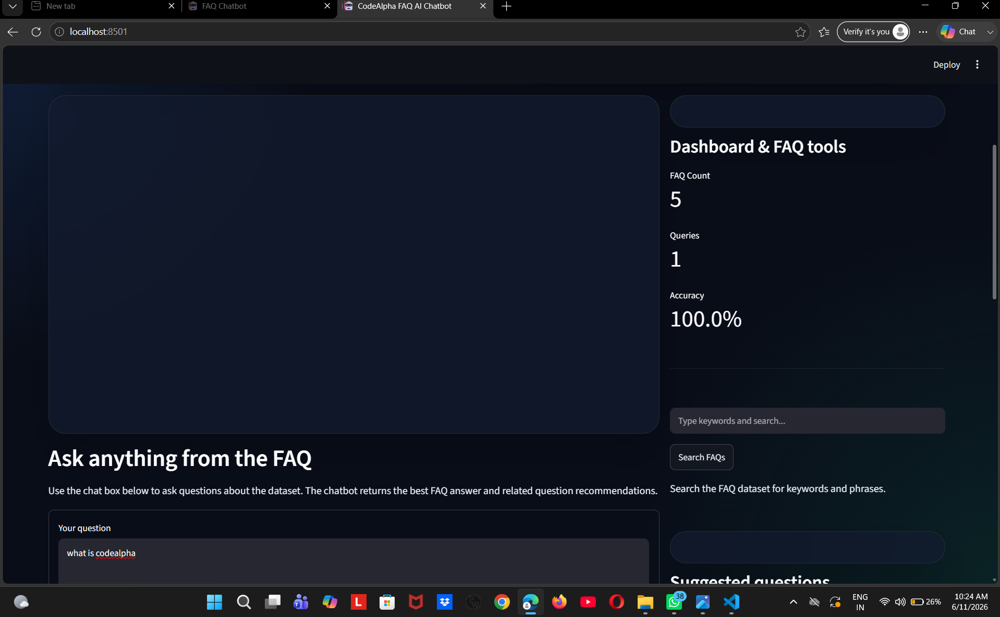

# 🤖 AI FAQ Chatbot

A professional AI-powered FAQ Chatbot developed using Python, Streamlit, Pandas, and Scikit-learn. This chatbot uses Natural Language Processing (NLP) techniques to understand user questions and provide the most relevant answers from a predefined FAQ dataset.

## 🚀 Features

- AI-powered FAQ Chatbot
- Natural Language Processing (NLP)
- TF-IDF Vectorization
- Cosine Similarity Matching
- Modern and Responsive User Interface
- Chat History Support
- Confidence Score Display
- Suggested Questions
- Statistics Dashboard
- Professional Dark Theme
- Fast and Accurate Responses

## 🛠️ Technologies Used

- Python
- Streamlit
- Pandas
- Scikit-learn
- TF-IDF Vectorizer
- Cosine Similarity
- Custom CSS

## 📸 Screenshots

### Home Page

### Chatbot Response

### Dashboard

### Expanded FAQ Section

## 📂 Project Structure

CodeAlpha_FAQ_Chatbot

├── app.py

├── faq_data.csv

├── requirements.txt

├── README.md

└── screenshots

  ├── home_page.png

  ├── chatbot_response.png

  ├── dashboard.png

  └── features.png

## ⚙️ Installation

### Clone Repository

git clone <repository-link>

### Navigate to Project Folder

cd CodeAlpha_FAQ_Chatbot

### Install Dependencies

pip install -r requirements.txt

### Run Application

streamlit run app.py

## 🎯 Project Objective

The objective of this project is to develop an intelligent FAQ Chatbot that understands user queries and returns the most relevant answers using Natural Language Processing techniques.

## 🔮 Future Improvements

- Voice-based Interaction
- Multi-language Support
- Database Integration
- LLM Integration
- Real-time Learning
- Advanced AI Response Generation

## 👩‍💻 Developer

**Lumbini Devi**

B.Tech CSE Student

AI Enthusiast | UPSC Aspirant

LinkedIn: (Add Your LinkedIn Profile Link)

GitHub: https://github.com/codewithlumbinidevi-hub

## 📜 License

This project was developed for educational and internship purposes as part of the CodeAlpha Artificial Intelligence Internship Program.
